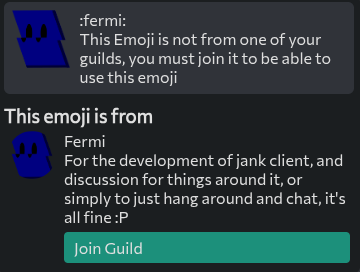
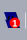
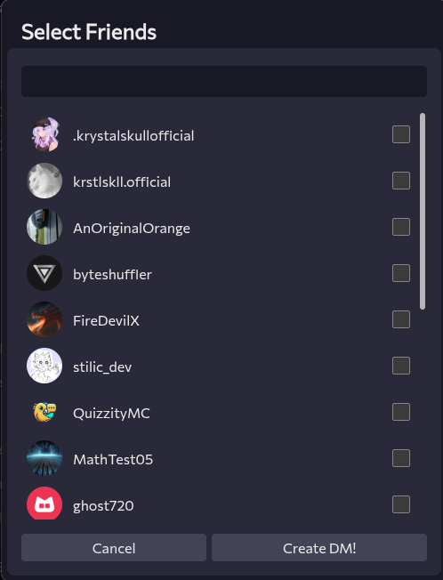

---
date:
  created: 2025-10-11
pin: true
links:
  - Homepage: index.md
  - Fermi: https://fermi.chat
categories:
  - Fermi
tags:
  - fermi
authors:
  - mathium05
slug: updates
comments: true
description: This week we got a bit done, including Group DMs, animations, and updating the favicon! 
---

# Group DMs, Animations, and Favicon updates!
This week we got a bit done, including Group DMs, animations, and updating the favicon! 

<!-- more -->

## this weeks updates

### Animations everywhere!
Many parts of Fermi are now animated, going in and out of menus, to the various things that pop up or go out of existence!

(please comment if something could be improved for the animations, I want to try to make this as great as it can be!)
### Emoji guild info

Now when you click on an emoji you'll get information about what guild it's from and the ability to join it!

### Dynamic Favicons

Fermi will now display the number of pings on the tab icon!

### Group DMs

You can now create and use group DMs on Fermi!
(there is currently a bug with the server preventing the setting of the name/icon from applying correctly)
### Minor improvements
* Unreads don't show for stuff that was sent before you joined
* The channel focus indecator in DMs now moves
* Loading messages now uses progressive loading to reduce loading times
* Hover events have been restyled to look better
* Image role icons are now preferred over emoji role icons
* Escape can now exit more menus

### Bug fixes
* DMs should now work properly again
* Login should be more tolerant to weirdly formatted urls
* Member list should no longer be made for DMs
* Unreads should work much more consistently
* Clear replying style on Escape key press
* You can send spoilered images again
* Guilds will now always have a default of an empty emoji array preventing various bugs
* Friend menu should now render correctly
* Home unreads should now show on boot
* Infinite scroller no longer freaks out if you've deleted the most recent message.
* Friends list no longer shrinks to make room for more friends, instead it scrolls

### Mitigations
* No mitigations this week!

### Discovered Spacebar Bugs
* [Group DMs aren't able to read icon/name properties](https://github.com/spacebarchat/server/issues/1335)

### Day late
Sorry for being a day late, had a busy week with school, but rest assured, I am going to try to maintain weekly updates on this blog!

If you guys have anything you'd like to see feel free to [open an issue](https://github.com/MathMan05/Fermi/issues/new) or say your ideas in the [Fermi Spacebar guild](https://fermi.chat/invite/USgYJo?instance=https%3A%2F%2Fspacebar.chat) or even the [Spacebar Discord Server](https://discord.gg/JDjMXTGeY9)
