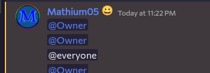

---
date:
  created: 2025-09-19
pin: true
links:
  - Homepage: index.md
  - Fermi: https://fermi.chat
categories:
  - Fermi
tags:
  - fermi
authors:
  - mathium05
slug: updates
comments: true
description: Fermi has had various improvements, including but not limited to, guild organization, a volume slider for notifications, role pings, and fixing the docker builds.
---
# The Productive Week

I've made various improvements, including but not limited to, guild organization, a volume slider for notifications, role pings, and fixing the docker builds.

<!-- more -->
### Guild Organization

Now in the most recent update, you can now organize the guilds you're in, both the order and folders, it all should work, please let me know of any bugs this has if you run into any.

### Notification Sound Slider

Finally, a long awaited feature, the ability to not make the notifications as loud as physically possible

### In-app blog updates

On start up Fermi will now look for blog updates if they're enabled. And everyone will be asked if they want to have blog updates enabled on second launch.

### Per Channel Message Drafts
Another long awaited feature, per channel message drafts, which means that you can be typing something in one channel and switch to another and it won't carry over anymore, it'll just be for that channel!

### Everyone and Role pinging

Now you can ping everyone and roles within Fermi and have both display correctly! Yet another feature thats been long awaited for!

### URL Refreshing
Now Fermi will refresh attachment URLs instead of displaying a dead file to the user.

### Escape key now cancels stuff
Escape makes it so you're not replying to anyone, and also wipes your attachments.

Implements [this](https://github.com/MathMan05/Fermi/issues/111) issue

### Fixed Docker Builds
Docker builds now *should* be working again, so anyone who uses docker should be pleased to know this.

### Minor improvements
* Esc now marks a channel as read along with ctrl+Esc marking a guild as read which fixes [this](https://github.com/MathMan05/Fermi/issues/113)
* Sending a message now snaps to bottom
* Hover events no longer stick around
* [Gif menu supports mobile screens better](https://github.com/MathMan05/Fermi/issues/117)
* Spaces now cancel autofill
* Bumped nodejs version in docker image from 18 to 20
* everyone ping is now displayed in messages when it's pinged
* Deleting the currently selected role now switches to a different role
* There's now a button in the role settings to delete a role
* You can now create a channel/category from the guild right click menu

### Bug fixes
* Sticker pop up now works properly on mobile
* [Reactions no longer duplicate](https://github.com/MathMan05/Fermi/issues/115)
* Sounds now should play consistently 
* Flash should no longer happen when flash is active
* Messages now use the function to check if a user is mentioned instead of doing its own thing
* Trying to ping people in dms now works correctly
* Role pings now ping roles correctly
* Color picker now always returns the correct type

### Mitigations
* [Added mitigation for server edit bug](https://github.com/spacebarchat/server/issues/1319)

### Discovered Spacebar Bugs
* [Invalid pings cause various errors](https://github.com/spacebarchat/server/issues/1326)
* [message role pings send a weird object array instead of an array of snowflakes](https://github.com/spacebarchat/server/issues/1327)
* [guild_folders was not able to shrink when set to a smaller array](https://github.com/spacebarchat/server/pull/1328/files) (patch submitted)

If you guys have anything you'd like to see feel free to [open an issue](https://github.com/MathMan05/Fermi/issues/new) or say your ideas in the [Fermi Spacebar guild](https://fermi.chat/invite/USgYJo?instance=https%3A%2F%2Fspacebar.chat) or even the [Spacebar Discord Server](https://discord.gg/JDjMXTGeY9)
