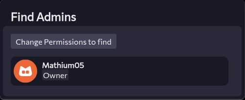
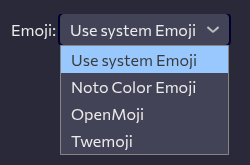

---
date:
  created: 2025-09-12
pin: true
links:
  - Homepage: index.md
  - Fermi: https://fermi.chat
categories:
  - Fermi
tags:
  - fermi
authors:
  - mathium05
slug: updates
comments: true
description: this 3 weeks in Fermi, I've added an admin look up, Emoji font selector, and implemented more markdown stuff
---
# The last 3 weeks in Fermi

There've been various improvements, including an admin finder, an Emoji font selector, Markdown improvements and a barrage of bug fixes. 

<!-- more -->
### Sorry for being late
I know I've missed two weeks, but this post will try to cover the last 3 weeks, though not a tonne happened those first two weeks due to being busier with stuff.

### Admin Finder
I've implemented an admin finder panel to more easily let people find the people with moderator privileges, instead of having to guess by the role names.

### Emoji Font Selector
There's now a selector for the font that your emoji will come from!

### Minor improvements
* <link\> now works correctly
* Implemented the escape char in md `\`
* added support for markdown lists
* \[text\](<link\>) now works correctly

### Bug fixes
* Save changes buttons now works on mobile
* Permisions now save when saved from Display settings
* Z-index of the role maker is now correct, allowing for the creation of roles
* Fixed settings Emoji picker not showing up
* Re-enabled borked mode for op code 8
* Fixed emoji and gif picker for mobile
* Fixed scaling bug for unloaded images
* Fixed bug where emoji/gif box wouldn't work on mobile

If you guys have anything you'd like to see feel free to [open an issue](https://github.com/MathMan05/Fermi/issues/new) or say your ideas in the [Fermi Spacebar guild](https://fermi.chat/invite/USgYJo?instance=https%3A%2F%2Fspacebar.chat) or even the [Spacebar Discord Server](https://discord.gg/JDjMXTGeY9)
