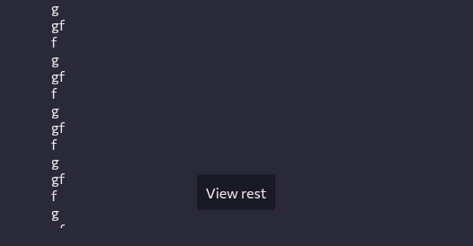
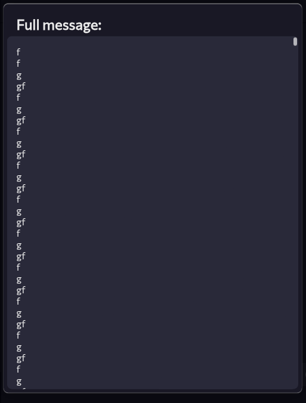
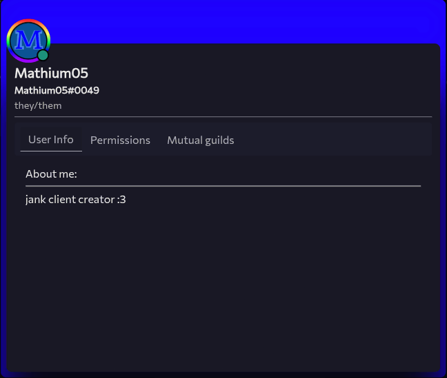

---
date:
  created: 2025-08-15
pin: true
links:
  - Homepage: index.md
  - Fermi: https://Fermi.com
categories:
  - Fermi
tags:
  - fermi
authors:
  - mathium05
slug: updates
comments: true
---

# Logging Out, Bundling and Bug Fixing!
This week fermi has gotten several updates which includes, bundling, logging out, long message collapsing, and bug fixing

<!-- more -->

## this weeks updates

### Bundling
While most of you likely don't care, I got bundling to work within Fermi, which means instead of getting a lot of smaller JS files it's one big file, which should reduce load times on networks with high ping, as the files no longer need to be loaded for the browser to figure out what other files need to be loaded.

### Long message collapsing
This should mean that Fermi should no longer crash when a very long message is created, and now instead Fermi should just be able to display the whole message.

This should fix [this](https://github.com/MathMan05/Fermi/issues/77) bug due to preventing the situation that would cause this bug to arise.

While this would not be possible on discord, Spacebar does not make any such line count checks and the char limit can be much longer too, both making for very very long messages being possible.

### Implemented logging out
Now logging out is implemented, this works both from the settings menu and from the account switcher so you can purge accounts on dead instances, and get rid of accounts without having to go into them.

??? warning "Nerd Alert"
	So to implement right clicking in the account switcher menu required a slight rework of the system that handles menus that disappear when you click away from them, as it used to only allow for one menu, and now it allows for multiple, and it allows for a function to be called instead of copying and pasting the same code snippit everywhere. (I don't know why it wasn't a function before)

### Full screen profiles
I've finally added support for the full screen profile, while it's not quite finished yet, it now exists!

### Minor improvements
* Modified the homepage for better SEO
* Added a blog section to the homepage
* Added more spacing between the accounts on the switcher
* Tweaked the member list CSS a little
* Added a white line for selected items in settings

### Bug fixes
* [After account switching you can send messages now](https://github.com/MathMan05/Fermi/issues/102)
* 2FA login broke and is now fixed
* Disabling 2FA broke and is now fixed
* [The scroller should no longer crash to very long messages](https://github.com/MathMan05/Fermi/issues/77)
* Fix crash that would happen if you clicked on a profile

If you guys have anything you'd like to see feel free to [open an issue](https://github.com/MathMan05/Fermi/issues/new) or say your ideas in the [Fermi Spacebar guild](https://fermi.chat/invite/USgYJo?instance=https%3A%2F%2Fspacebar.chat) or even the [Spacebar Discord Server](https://discord.gg/JDjMXTGeY9)
