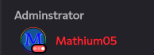
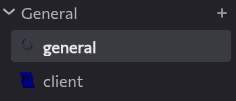

---
date:
  created: 2025-12-06
pin: true
links:
  - Homepage: index.md
  - Fermi: https://fermi.chat
categories:
  - Fermi
tags:
  - fermi
authors:
  - mathium05
slug: updates
comments: true
description: This week in Fermi I've implemented Member list fixes and improvements, channel icons, and have fixed the bug in spacebar that prevented status's from updating while the client was running. 
---
# Member list fixes, Channel icons and Status fixes!
This week in Fermi I've implemented Member list fixes and improvements, channel icons, and have fixed the bug in spacebar that prevented status's from updating while the client was running. 

<!-- more -->

## this weeks updates

### Member list status updates
The member list will now update status and has typing indicators now too! This was due to improvements in Fermi and fixes in Spacebar both made by me.

### Channel icons
Channels can now have icons! Feel free to set them to whatever you heart desires, wether it be a PNG, GIF or nothing at all!

### Freeze more things
Guild icons if animated will be frozen by Fermi unless hovered over now!

### Guild Names on Hover
Guild names now show up when you hover over the guild icons!

### Pasting fixes
Pasting should now work as you'd expect it to work. Firefox pasting issues should be resolved and the general issue of \<link\> pasting has been fixed

## Other stuff
There's been more work on WebRTC stuff on the server side to the extent where it's actually starting to not segfault on the main instance, so for some Voice chats may actually work! Though many have voiced issues about connection/fermi bug type issues and it doesn't work across all browsers. Thanks for the work done by loan fc and maddy for getting the NPM stuff sorted out!

In other news, I will likely not be as active next week, I have finals.

### Minor improvements
* Embeds width is now more dynamic
* Fermi now deals with MESSAGE_ACK
	- This allows read states to always stay in sync
* Fermi should now play sounds more consistently

### Bug fixes
* Webauth menu now has final strings in place and will be able to be translated
* DM pfps no longer have faulty backgrounds
* Embeds colors render properly
* Let op 8 happen again for large guilds
* MarkDown links are allowed to have Markdown inside of them
* WSS websockets for Voice Gateway
* clicking on an emoji that's in the UI is less likely to bring up the guild menu
* Embeds now have a default color
* Embeds are now allowed to be pure black
* Reaction hover is now translatable
* Mostly fixed Firefox Markdown preview issues

### Mitigations

### Discovered Spacebar Bugs

### Spacebar fixes
* [Status updates should now work](https://github.com/spacebarchat/server/pull/1410)
* [Invis users should no longer be exposed](https://github.com/spacebarchat/server/pull/1410)
* [Fix stopwatch class](https://github.com/spacebarchat/server/pull/1413)
* [No more duped events](https://github.com/spacebarchat/server/pull/1415)
* [Channel search for DMs](https://github.com/spacebarchat/server/pull/1416)
	- [Fixes](https://github.com/spacebarchat/server/issues/1271) and [Fixes](https://github.com/spacebarchat/server/issues/1095)
	

### The Best Way of Reporting Bugs/Feature Requests
If you want to be credited and have better chances of your ideas coming to life please [submit an issue on github](https://github.com/MathMan05/Fermi/issues)! This makes things easier for me as everything is in one place, and you can be credited in the blog posts as well via a link to the issue you have created!

If you guys have anything you'd like to see feel free to [open an issue](https://github.com/MathMan05/Fermi/issues/new) or say your ideas in the [Fermi Spacebar guild](https://fermi.chat/invite/USgYJo?instance=https%3A%2F%2Fspacebar.chat) or even the [Spacebar Discord Server](https://discord.gg/JDjMXTGeY9)
