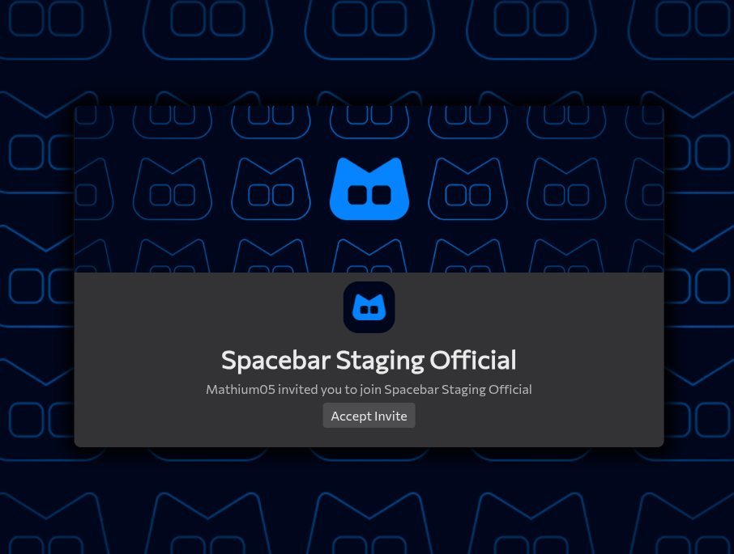

---
date:
  created: 2026-01-03
pin: true
links:
  - Homepage: index.md
  - Fermi: https://fermi.chat
categories:
  - Fermi
tags:
  - fermi
authors:
  - mathium05
slug: updates
comments: true
description: invites improvements, and a few smaller fixes.
---
# Invite improvements
Sorry for the late post y'all, been busy and been taking a break after all of the busy-ness to try to get back into the swing of things. 
<!-- more -->
(In case y'all are curious I've been working on my RISCV IDE for fun, it's not as hard as it sounds lol)

## this weeks updates

### Invites have been improved!

Invite pages are now much better looking, showing both the banner and discovery splash of the guild!

### Minor improvements
* You can now set discovery splash
* Wellknown v2 was implemented by Emma

### Bug fixes
* Invalid invites now show they're erroring
	- [fixes](https://github.com/MathMan05/Fermi/issues/192)

### Mitigations

### Discovered Spacebar Bugs

### Spacebar fixes
* [Don't expose full user object on invites](https://github.com/spacebarchat/server/pull/1449)
* [Fix server form errors](https://github.com/spacebarchat/server/pull/1450)

### The Best Way of Reporting Bugs/Feature Requests
If you want to be credited and have better chances of your ideas coming to life please [submit an issue on github](https://github.com/MathMan05/Fermi/issues)! This makes things easier for me as everything is in one place, and you can be credited in the blog posts as well via a link to the issue you have created!

If you guys have anything you'd like to see feel free to [open an issue](https://github.com/MathMan05/Fermi/issues/new) or say your ideas in the [Fermi Spacebar guild](https://fermi.chat/invite/USgYJo?instance=https%3A%2F%2Fspacebar.chat) or even the [Spacebar Discord Server](https://discord.gg/JDjMXTGeY9)
