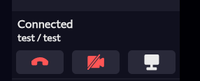
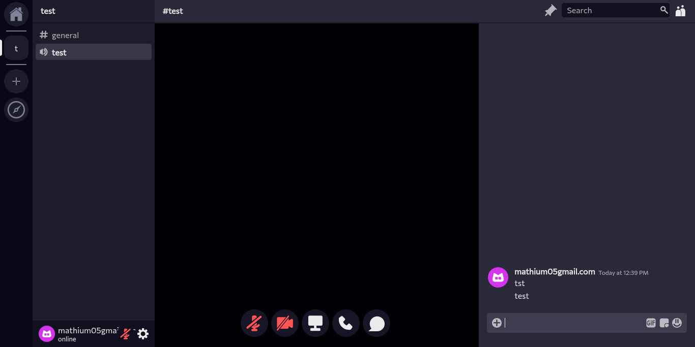
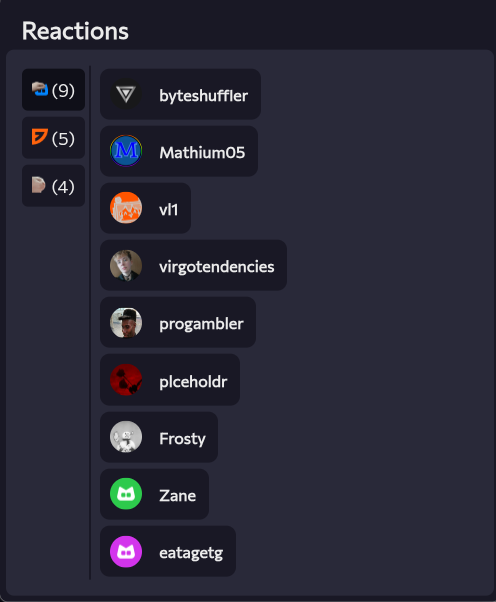
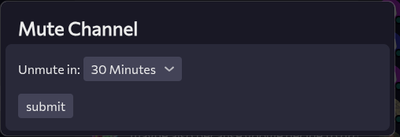
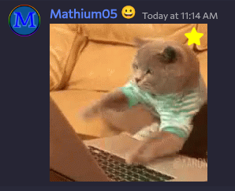
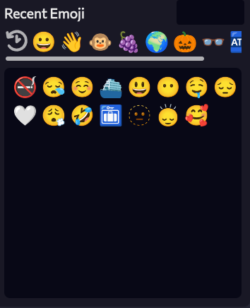
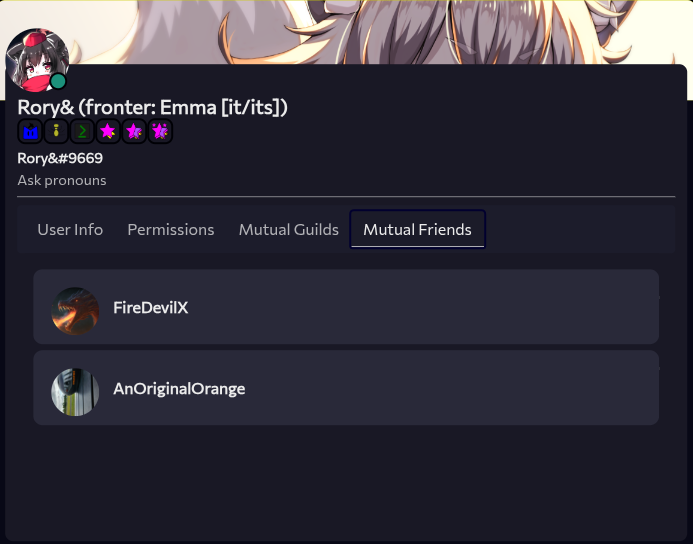

---
date:
  created: 2025-10-03
pin: true
links:
  - Homepage: index.md
  - Fermi: https://fermi.chat
categories:
  - Fermi
tags:
  - fermi
authors:
  - mathium05
slug: updates
comments: true
description: Fermi has gained additional WebRTC support along with work on favorites and a lot of bug fixing!
---

# WebRTC Work and Favorites
This week in Fermi updates, I've implemented more stuff to do with WebRTC, implemented some of the favorites API, and have fixed a tonne of bugs along with various other improvements. 

<!-- more -->

## this weeks updates

### WebRTC Work Continues
I've continued to work on WebRTC support, and now Fermi has this little menu fully working.

Chat within Voice channels is now working

### Reaction Viewer

You are now able to view who made what reactions within Fermi!

### Muting Channels

You are now able to mute channels

<small> [Implements Issue](https://github.com/MathMan05/Fermi/issues/118) </small>

### Ghost messages are now more normal
Instead of having a special area for messages that aren't sent yet, they're now going to be in the scroller with everything else. 

Errored messages will go to the bottom as well, so that way you don't loose track of them after they error.

### Message links
Message links are now functional and should work as expected along with a button in the right click menu.

### Reaction suggestions

Now Fermi will suggest Reactions based on reactions you've used in the past.

### Gif Favoriting

Now you can favorite gifs on Fermi!

### Emoji History

You can now view recent emojis which are sorted by how often you use them!

### Mutual Friends

You can now view your mutual friends on spacebar from the big profile view!

### Minor improvements
* Voice chat status strings are now able to be translated
* When stopping a stream on the OS level the stream now ends in client
* Added a button in the right click menu to say if a message was sent with Fermi
* [Right click menu no longer overrides for highlighted text](https://github.com/MathMan05/Fermi/issues/124)
* Reaching the bottom now is a range instead of hitting 0
* Permission settings for guilds are now green and grey instead of green and red to make it more clear that these can not filter permissions, unlike channels
* `/app` now redirects to `/channels/@me`
* The stickers menu will now have vertical space between the stickers
* Message links now jump to the message when clicked on instead of opening the link

### Bug fixes
* When fetching a user by ID authorization is now sent
* Fixed bug where self streams don't show on chromium
* Video playback is now working
* Jumping to unloaded messages via search now works
* Going to a certain message now works more consistently
* Infinite scroller no longer reloads channels messages constantly
* Loading screen no longer messes with loading of messages
* Invites now render correctly
* [Search now works correctly](https://github.com/MathMan05/Fermi/issues/123)
* Text should now be centered in the search box
* Messages no longer try to render twice (bug caused a lot of errors to log to the console, but nothing visual)
* Attachments on message previews are now normally sized
* Videos are no longer square
* Invites no longer display ontop of member list
* Replying to a message only containing a sticker should now act as excpected
* `\` now correctly does not escape when it can't
* Links no longer go above spoilers
* all bugs involving ghost messages not going away should be fixed
* When hovering over any of the search bar cursor text should now be used
* Using navigation to go back to /channels/@me now works as expected
* Menus buttons that aren't the main user menu no longer show up with white lines under them
* Removing an attachment will no longer cause attachments to not be able to send
* Bug where guild bar things will stick and not come off is now fixed
* Broke then fixed unreads
* Links now generate with rel ="noopener noreferrer" to prevent some security issues

### Mitigations
* When creating a webhook the url is not returned in the response, now Fermi recreates the URL.

### Discovered Spacebar Bugs
* When WebRTC video starts, stops, and starts again, the video freezes for a bit until it will resume again
* Video attachments don't have a defined height/width

### The Reporting Message Type
I've gone ahead and created the complex type for this feature, though I'm not mentioning this earlier due to it not effecting the user and the sever not supporting it right now.

If you guys have anything you'd like to see feel free to [open an issue](https://github.com/MathMan05/Fermi/issues/new) or say your ideas in the [Fermi Spacebar guild](https://fermi.chat/invite/USgYJo?instance=https%3A%2F%2Fspacebar.chat) or even the [Spacebar Discord Server](https://discord.gg/JDjMXTGeY9)
