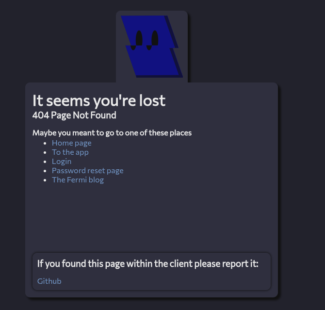
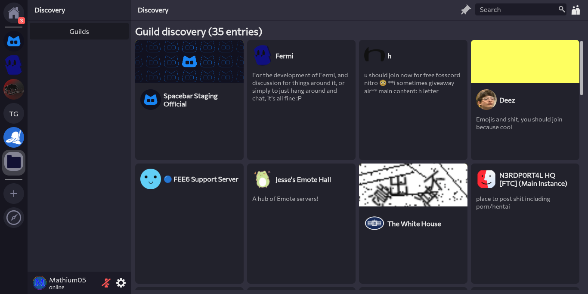
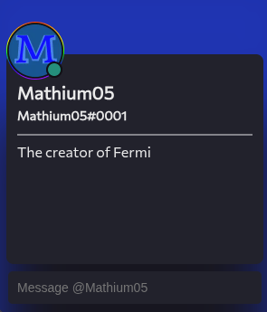
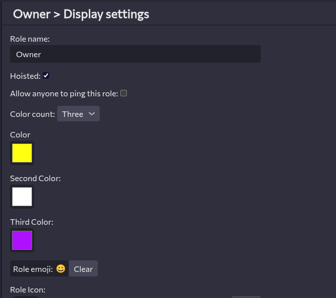

---
date:
  created: 2025-10-17
pin: true
links:
  - Homepage: index.md
  - Fermi: https://fermi.chat
categories:
  - Fermi
tags:
  - fermi
authors:
  - mathium05
slug: updates
comments: true
description: This week in Fermi I've implemented Gradient roles, a 404 page, and made the non-main parts of Fermi load faster, along with this Fermi has reached 50 stars on github!
---

# Gradient Roles, 404 pages, faster loading and more!

This week in Fermi I've implemented Gradient roles, a 404 page, and made the non-main parts of Fermi load faster! Translation and 2FA support has gotten better too!
<!-- more -->

## Thank you for 50 Stars!
I know it's just a random number, but I do enjoy seeing it go up! So thank you all for the 50 stars!

[If you so feel inclined, you too can star Fermi :3](https://github.com/MathMan05/Fermi)
## this weeks updates
### Webkit Scrolling Support
Now it kinda works under webkit, if someone else would like to fix this in a better way, be my guest, this currently kinda sucks, you'll want to edit the watchForTop function of the infintescroller.

??? info "It's still kinda janky"
	I know, but it's way batter than what came before, and it's hard to do this. I rely on [this](https://developer.mozilla.org/en-US/docs/Web/CSS/overflow-anchor) feature for my scroller to work properly, and since safari doesn't support it yet, scrolling is kinda weird.

### Notification Clumping
Now when you get many messages from the same source it'll delete the individual messages and clump them together by channel so you don't have to deal with a tonne of individual messages.

### Disentanglement of Imports
With the recent steps to make the imports less of a mess certain pages scripts should load much faster.

??? info "What does this exactly mean?"
	I've gotten rid of circular imports that made various pages bundled JS include nearly all of the code, now they're much more lean and mostly only include what they need and not a tonne more.

??? info "In practice what does this do"
	As a user, not much unless you have really slow internet, then it might matter, but only for the login/register/home pages, as these pages don't need all of the code to function, but pages like the main app won't be much smaller if at all smaller due to this change.

### 404 Page

Now if you visit an invalid page on Fermi, the 404 page should result! It'll also present users with links to various parts of Fermi so that way users will be able to navigate where they meant to go.

You should never actually see this page unless you edit the URL to reach an invalid page, before it just sent the main app, but this is a much better solution.

### Better I18n(Translation) Support
Instead of using the getTranslation call, it now does it a different way, which means they translations are type checked now, so now they are much less likely to break with an update!

(while doing this I found several incorrect translations, so glad I went through and did this)

I also reworked how individual elements of a page are translated, so instead of the script having to get them and set their text, they now have a special property to set what their translation string is.

### Discovery Rework

While still being a WIP, there's been a rework of discovery to make it not a pop up, instead having it be a part of the main interface like one would expect.

### Typing Anywhere in Channel Focus's Text Box
Now if you type anywhere within the channel it should automatically focus to the text box! This should help align with other platforms that do the same.

### Message Box on User Profiles

There's now a message box on user profiles that allows you to more easily start dms and type out your messaages in the profile instead of having to right click and navigate to the DMs that way!

[implements](https://github.com/MathMan05/Fermi/issues/133)

### Role Gradients

Roles Gradients are now implemented in Fermi and can be set with 1-3 colors! This allows for greater customization in role colors!

### Fermi Now has a Sitemap
What does this mean for you? not much, but it will make Fermi more searchable, and hopefully get Fermi higher in the search results.

??? info "Oh, neat, how do I set this up for my instance?"
	It's just an environment variable named URL, set that to the URL of your page (including the https://) and it should be good to go! It'll automatically append to the robots.txt and generate the sitemap, this should not break in the future.

### You Can Now Technically Host Fermi Without URL Rewrites
Now Fermi will automatically refresh on the 404 page if it detects that the current page is valid, and the service worker can do the rewrite, this is not recommended for hosting, but it should work in a pinch

??? warning "I've always wanted to do that!"
	Please, just don't, it does work, but it's not ideal for several reasons. It'll make several pages just the 404 page for search results and will make embeds for your instance not be as nice.

### Minor improvements
* Member list loads faster
* Context Menu is now animated
* The pickers (emoji/sticker/gif) are now animated
* Settings menu animations are less annoying
* Settings menu animations are not played on mobile
* The translation system is now built better for the less dynamic pages
* The text box now has default text
* Reset password menu is a little more friendly now
* Emoji are now larger when sent by themselves [fixes](https://github.com/MathMan05/Fermi/commit/f6b7f686339513c48389f8d63fc77e2431678e44)
* Edits aren't sent if they don't edit anything [fixes](https://github.com/MathMan05/Fermi/issues/140)
* Bot tags are in more places now [fixes](https://github.com/MathMan05/Fermi/issues/136)

### Bug fixes
* checks no longer clear on search for group dms
* Home ping no longer goes above everything on mobile
* Unbreak account switcher
* Unbroke opening DMs
* Unbroke homepage translation
* Images when uploaded no longer blow up to huge sizes
* Fixed File upload text
* Service worker settings should now always show correctly
* Fixed a variety of 2fa translation bugs that prevented it from working correctly
* api urls ending in `/` are now correctly handled
* Leaving a guild now automatically navigates away from the guild in the GUI
* Fixed bug that caused file upload size to freak out in small windows
* Fix scrolling in settings
* Fixed self DMs
* Group chats are no longer thought of as DMs that are open with that user
* Autofill no longer tries to work if it was not a space before it
* Markdown events no longer fire in replies
* No more double enters [fixes](https://github.com/MathMan05/Fermi/issues/139)
* DMs ping count goes up on new messages
* Fixed 0 ping dm bug
* Manage channels is now needed for deleting channels

### Mitigations
* Fixed on the Fermi side a bug where Group channels on creation send the user as a recipient in the event.
* Fixed mentions on messages

### Discovered Spacebar Bugs
* [last message id was not being updated for all message create events](https://github.com/spacebarchat/server/issues/1336)
* [Sometimes relationships can't be deleted](https://github.com/spacebarchat/server/issues/1337)
* [Default message notifications in a guild is not used as the default](https://github.com/spacebarchat/server/issues/1338)
* [Group channels on creation send the user as a recipient in the event](https://github.com/spacebarchat/server/issues/1339)
* [Mentions are incorrectly sent](https://github.com/spacebarchat/server/issues/1340)
* [User settings patch should be a partial](https://docs.discord.food/resources/user-settings#modify-user-settings)

### The Best Way of Reporting Bugs/Feature Requests
If you want to be credited and have better chances of your ideas coming to life please [submit an issue on github](https://github.com/MathMan05/Fermi/issues)! This makes things easier for me as everything is in one place, and you can be credited in the blog posts as well via a link to the issue you have created!

If you guys have anything you'd like to see feel free to [open an issue](https://github.com/MathMan05/Fermi/issues/new) or say your ideas in the [Fermi Spacebar guild](https://fermi.chat/invite/USgYJo?instance=https%3A%2F%2Fspacebar.chat) or even the [Spacebar Discord Server](https://discord.gg/JDjMXTGeY9)
