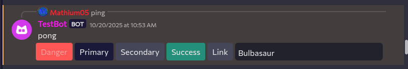
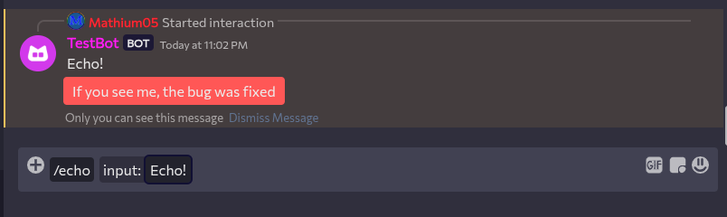

---
date:
  created: 2025-10-24
pin: true
links:
  - Homepage: index.md
  - Fermi: https://fermi.chat
categories:
  - Fermi
tags:
  - fermi
authors:
  - mathium05
slug: updates
comments: true
description: This week has been a lot of work on getting the outline of interaction working, which should allow for much richer bot interactions in the future!
---

# Initial Interaction Work
This week has been a lot of work on getting the outline of interaction working, which should allow for much richer bot interactions in the future!

<!-- more -->
### Thinking about stable releases
With Fermi getting more and more features, a stable release is starting to look viable and like a good option for those who just want to use Fermi as a chat platform and don't need the newest features all of the time, though I don't know exactly how to do this yet, or how often to release new builds of Fermi. (I am very open to advice/ideas) Also with this there are a few things I do think need to be finished before a stable release should happen
* Better mobile support
* Fixing all of the icons (I know they're not the best)
* WebRTC fixes (it's a lot better, but it still needs some polish)
* A lot of bug fixing
* Reworking the audio system into an audio worklet (don't worry if you don't know what this means)
* Interactions being complete
* Reworked home page

More will likely be done before the stable release, but these are just some vauge goals for a stable realse of Fermi.

### Initial Interaction Work
Fermi now has some support for some interaction types, which include both commands and components, though work on neither is complete.

This is the start of work  on these features, and should eventually allow for more complex bot interaction on spacebar once everything is working!

(Thanks [Cyber](https://github.com/CyberL1) for their awesome interaction work, allowing for this to happen!)
### Minor improvements
* While resolving user pings will say they are

### Bug fixes
* You can no longer set replying in channels you can't send messages in
* Mentions no longer go above the search menu
* User pings will now always resolve 
* Member profiles should apply more [fixes](https://github.com/MathMan05/Fermi/issues/151)
* Channels that were previously not empty but became empty no longer cause Fermi to die.

### Discovered Spacebar Bugs
* [Ephemeral messages can be seen by all users](https://github.com/spacebarchat/server/issues/1348) (fixed)
* [Can't delete messages things reply to](https://github.com/spacebarchat/server/issues/1350) (fixed)
* [interactions should be allowed to have components](https://github.com/spacebarchat/server/issues/1351) (fixed)
* [Ephemeral messages components don't work correctly](https://github.com/spacebarchat/server/issues/1369)

### Spacebar fixes
* [Made it so that commands are always sent](https://github.com/spacebarchat/server/pull/1363/files)

### The Best Way of Reporting Bugs/Feature Requests
If you want to be credited and have better chances of your ideas coming to life please [submit an issue on github](https://github.com/MathMan05/Fermi/issues)! This makes things easier for me as everything is in one place, and you can be credited in the blog posts as well via a link to the issue you have created!

If you guys have anything you'd like to see feel free to [open an issue](https://github.com/MathMan05/Fermi/issues/new) or say your ideas in the [Fermi Spacebar guild](https://fermi.chat/invite/USgYJo?instance=https%3A%2F%2Fspacebar.chat) or even the [Spacebar Discord Server](https://discord.gg/JDjMXTGeY9)
